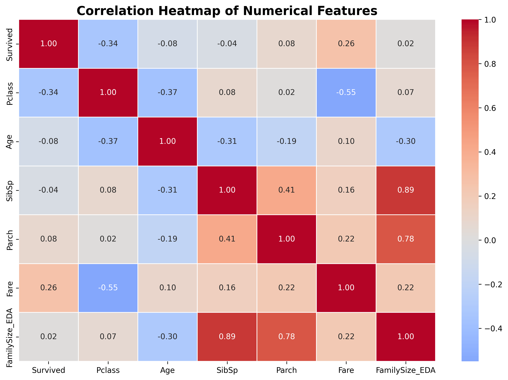
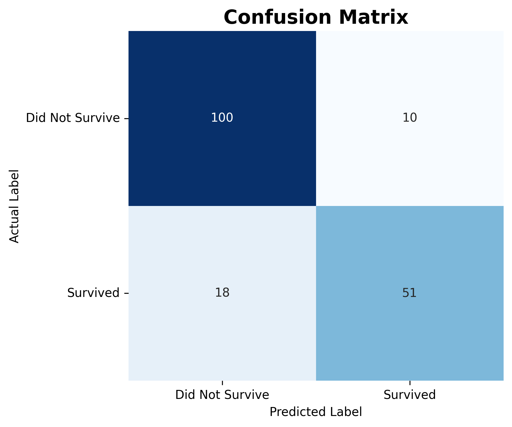
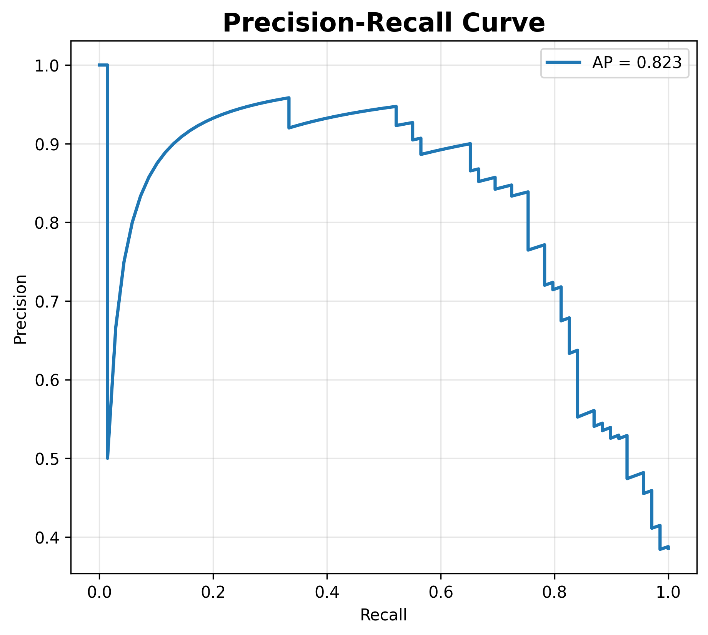
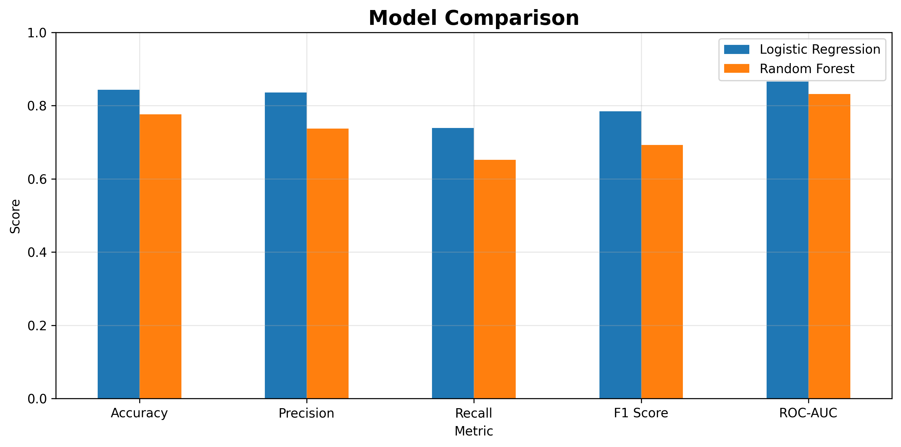
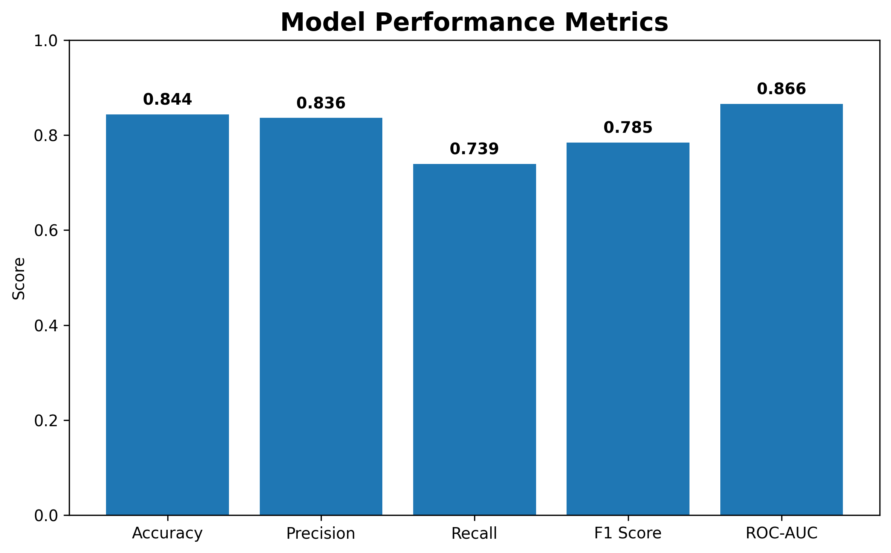

# 🚢 Titanic Survival Prediction ML Pipeline


A complete end-to-end Machine Learning pipeline that predicts Titanic passenger survival using feature engineering, preprocessing pipelines, model evaluation, cross-validation, and performance comparison.

---

# 📌 Project Overview

This project demonstrates a complete machine learning workflow using the famous Titanic dataset.

The objective is to predict whether a passenger survived the Titanic disaster based on passenger information such as:

- Age
- Gender
- Passenger Class
- Fare
- Embarked Port
- Family Size
- Cabin Information

The project emphasizes clean preprocessing, feature engineering, visualization, model evaluation, and comparison of multiple machine learning models.

---

# 📂 Project Structure

```
Titanic-Survival-Prediction-ML-Pipeline
│
├── data/
│   └── train.csv
│
├── notebook/
│   └── Titanic_Survival_Prediction_ML_Pipeline.ipynb
│
├── images/
│   ├── correlation_heatmap.png
│   ├── confusion_matrix.png
│   ├── model_comparison.png
│   ├── model_metrics.png
│   ├── precision_recall_curve.png
│   └── roc_curve.png
│
├── models/
│   └── model.joblib
│
├── requirements.txt
└── README.md
```

---

# 🚀 Machine Learning Pipeline

The project follows a complete ML workflow:

- Data Cleaning
- Exploratory Data Analysis
- Missing Value Handling
- Feature Engineering
- Feature Scaling
- One-Hot Encoding
- Logistic Regression Pipeline
- Random Forest Model
- Model Evaluation
- Cross Validation
- Model Comparison
- Model Serialization

---

# 🛠 Technologies Used

- Python
- Pandas
- NumPy
- Matplotlib
- Seaborn
- Scikit-Learn
- Joblib
- Google Colab

---

# 📊 Feature Engineering

The following preprocessing techniques were applied:

- Missing value imputation
- Standard Scaling
- One-Hot Encoding
- ColumnTransformer Pipeline
- Pipeline API

---

# 🤖 Models Used

### Logistic Regression

- Pipeline-based implementation
- StandardScaler
- OneHotEncoder
- ColumnTransformer

### Random Forest Classifier

Used for comparison against Logistic Regression.

---

# 📈 Model Evaluation Metrics

The following metrics were used:

- Accuracy
- Precision
- Recall
- F1 Score
- ROC-AUC
- Precision-Recall Curve
- Confusion Matrix
- Cross Validation

---

# 📉 Performance

### Logistic Regression

| Metric | Score |
|---------|--------|
| Accuracy | 84.4% |
| Precision | 83.6% |
| Recall | 73.9% |
| F1 Score | 78.5% |
| ROC-AUC | 86.5% |

---

# 📊 Visualizations

## Correlation Heatmap



---

## Confusion Matrix



---

## ROC Curve


---

## Precision Recall Curve



---

## Model Comparison



---

## Performance Metrics



---

# 🔁 Cross Validation

5-Fold Cross Validation was performed to ensure that the model generalizes well.

Average ROC-AUC remained consistent across folds, demonstrating model stability.

---

# 💾 Saving the Model

The trained model is stored using Joblib.

```python
joblib.dump(model, "model.joblib")
```

Load it later using:

```python
model = joblib.load("model.joblib")
```

---

# ▶️ Installation

Clone the repository:

```bash
git clone https://github.com/Vineesha04/Titanic-Survival-Prediction-ML-Pipeline.git
```

Install dependencies:

```bash
pip install -r requirements.txt
```

Run the notebook:

```bash
jupyter notebook
```

---

# 🎯 Future Improvements

- Hyperparameter Optimization
- XGBoost Implementation
- LightGBM
- CatBoost
- SHAP Explainability
- Streamlit Deployment
- Flask API

---

# ⭐ If you like this project

Please consider giving it a ⭐ on GitHub.
